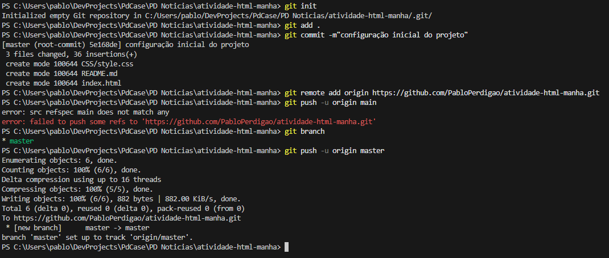
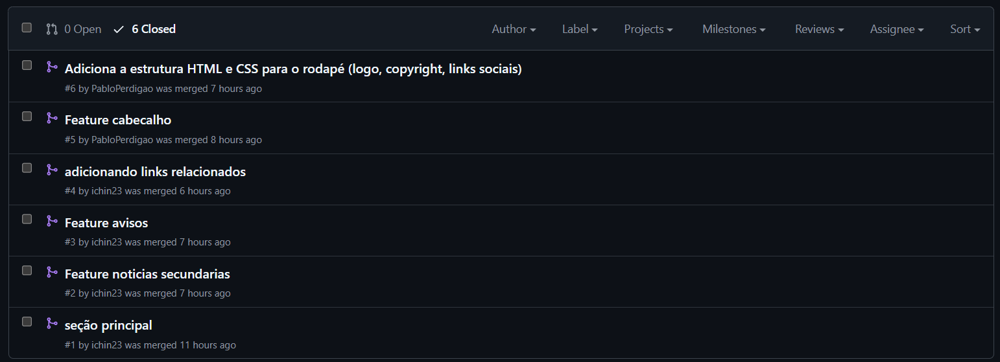

# PD Noticias | Atividade HTML
  
O PD Noticias, é um jornal que traz atualizações de prêmios, feriados, curiosidades e outras informações de interesse geral da empresa.

---

## Techs

- **HTML5**
- **CSS3**
- **Git**
- **GitHub**

## Funcionalidades

- Cabeçalho e navegação principal
- Seção de avisos
- Seção de noticias
- Seção de links relacionados
- Rodapé com informações sobre a PD Case

## Branches 

- `feature-cabecalho | Pablo`
- `feature-avisos | Pedro `
- `feature-noticias-principais | Pedro `
- `feature-noticias-secundarias| Pedro `
- `feature-linksRelacionados| Pedro `
- `feature-rodape | Pablo`

## Criação do Repositório, Commits e PRs
**1 - Criação do repo e primeiro commit:**

**2 - Pull requests:**

---

### Desenvolvido por: 
[Pablo Perdigão](https://github.com/pabloperdigao) & [Pedro Manoel](https://github.com/ichin23) 

